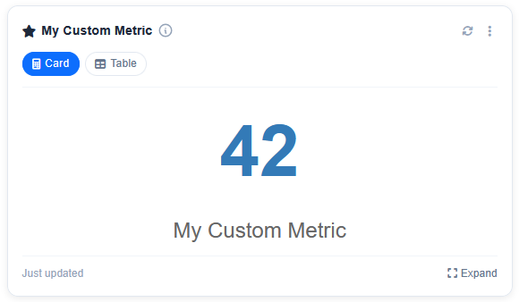
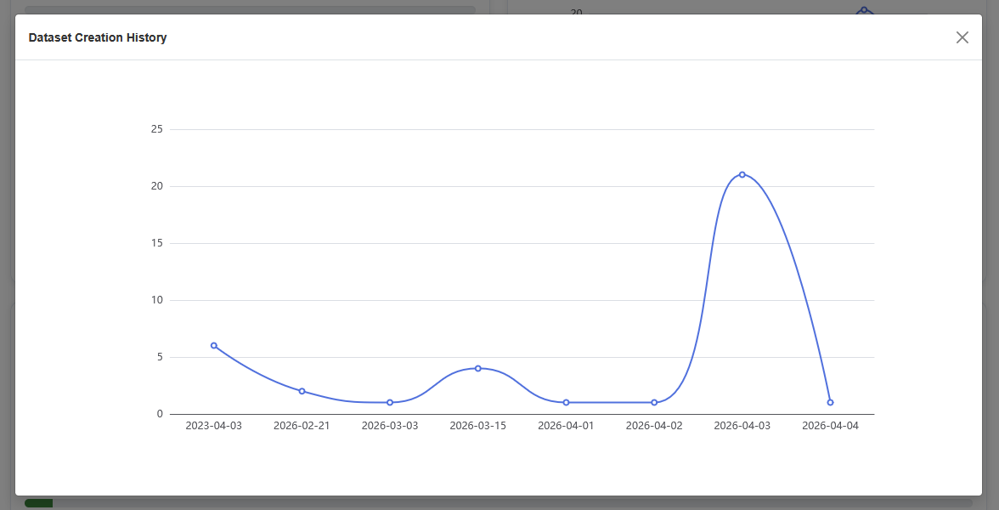
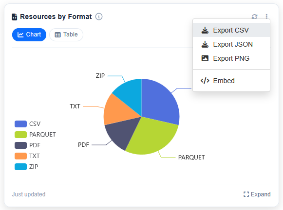
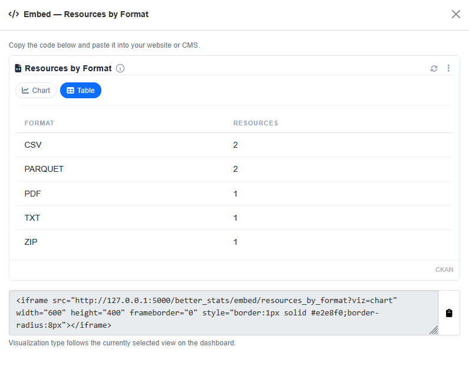

# Metrics Overview

In `ckanext-better-stats`, a Metric represents an encapsulated component responsible for tracking a specific aspect of data within the CKAN ecosystem. Each Metric is tightly integrated into the framework and exposes a standardized interface for both developers and end users.

Every metric in the framework automatically benefits from multiple built-in features:

### Expandable Modal

Click `Expand` to open a metric in a separate modal window.

### Export Dropdown

Click `Export` to open a dropdown menu with a variety of export options.

### Embedding

Each metric could be embedded in a standalone page, allowing users to view the data in a more accessible format.

You can copy the embed code from the modal and paste it into your own page.

### Visualization Types

Metrics are rendered in a variety of formats, including `CHART`, `TABLE`, `CARD`, and `PROGRESS`. Each visualization type is declared by the metric class along with a default visualization. The framework automatically renders the appropriate visualization for each metric.

### Caching

Metrics are cached with Redis, with a configurable TTL (time-to-live) value. You can refresh the cache at any time by clicking `Refresh` on a metric card or `Refresh All` in the dashboard toolbar.

### Access Control

Each metric is assigned an access level, which determines whether users can view the metric. While the dashboard is accessible to all users, not all metrics are visible to anonymous users. There are 3 access levels: `PUBLIC`, `AUTHENTICATED`, and `ADMIN`.
