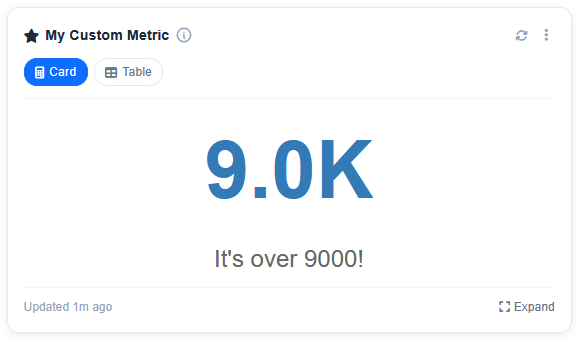

# before_metric_render_signal

The `before_metric_render_signal` signal provides a powerful way for your extension to dynamically alter data or visualizations for *any* metric right before it is forwarded to the client to be rendered.

## Modifying Render Data

Whenever `get_viz_data` pulls data for a metric (either computing it fresh or taking it from Cache), it fires this signal just before returning it to the user view.

Your receiver function receives a `context` dictionary containing:

- `metric`: The metric class instance making the payload request.
- `viz_type`: The visualization format being requested (e.g. `'card'`, `'chart'`).
- `data`: The prepared data dictionary.

See the example below:

```python
from ckanext.better_stats.metrics.base import before_metric_render_signal

class MyExtensionPlugin(p.SingletonPlugin):
    p.implements(p.IConfigurer)
    p.implements(p.ISignal)

    ...

    # ISignal

    def get_signal_subscriptions(self) -> types.SignalMapping:
        return {
            tk.signals.ckanext.signal("better_stats:before_metric_render"): [
                alter_metric_visualization,
            ],
        }


def alter_metric_visualization(sender, context, **kwargs):
    metric = context.get("metric")
    viz_type = context.get("viz_type")
    data = context.get("data")

    # Example 1: Alter our custom metric's visualization values based on condition
    if metric.name == "my_custom_metric" and viz_type == "card":
        # Override the payload value cleanly
        return {"value": 9000, "label": "It's over 9000!"}

    # Example 2: Alter an existing better_stats metric data output
    if metric.name == "user_count" and viz_type == "chart":
        # Modify the raw chart data structure here
        data["options"]["scales"]["y"]["beginAtZero"] = False
        return data

    # Return None to ignore and pass the responsibility to downstream handlers or use the default data.
    return None
```

Here's the altered custom metric card:


