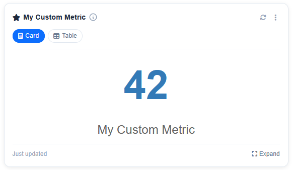

# register_metrics_signal

The `ckanext-better-stats` extension exposes `register_metrics_signal`, a blinker signal that allows external CKAN extensions to register their own custom metrics.

!!! tip
    Not limited to the four built-in visualization types either — see
    [Register Visualizations](./register_visualizations.md) to add your own
    (maps, word clouds, sparklines, …).

## Registration Process

1. Inherit from `ckanext.better_stats.metrics.base.MetricBase`.
2. Implement your metric logic (at a minimum, provide a `get_data()` method).
3. Connect a receiver function to `register_metrics_signal` using the `ISignal` interface.
4. Call `MetricRegistry.register(name, MetricClass)` inside your receiver.

See the example below:

```python
import ckan.plugins.toolkit as tk

from ckanext.better_stats.metrics.base import MetricBase, MetricRegistry, register_metrics_signal
from ckanext.better_stats import const

class MyCustomMetric(MetricBase):
    """Tracks things across the portal."""

    supported_visualizations = [
        const.VisualizationType.CARD,
        const.VisualizationType.TABLE
    ]
    default_visualization = const.VisualizationType.CARD
    icon = "fa-solid fa-star"

    def __init__(self) -> None:
        super().__init__(
            name="my_custom_metric",
            title=tk._("My Custom Metric"),
            description=tk._("Tracks awesome things across the portal"),
            order=200,
            access_level=const.AccessLevel.PUBLIC.value,
        )

    def get_data(self) -> int:
        return 42

    def get_card_data(self) -> dict:
        return {"value": self.get_data(), "label": self.title}

    def get_table_data(self) -> dict:
        return {
            "headers": ["Metric", "Value"],
            "rows": [["Awesome Things", self.get_data()]]
        }


class MyExtensionPlugin(p.SingletonPlugin):
    p.implements(p.IConfigurer)
    p.implements(p.ISignal)

    ...

    # ISignal

    def get_signal_subscriptions(self) -> types.SignalMapping:
        return {
            tk.signals.ckanext.signal("better_stats:register_metrics"): [
                self.register_metrics,
            ],
        }

    @staticmethod
    def register_metrics(sender: None):
        MetricRegistry.register("my_custom_metric", MyCustomMetric)

```

As a result, your metric will be available in the dashboard right away. See how it looks in the example below:



## Overriding a built-in metric

To change how a built-in metric behaves — a different query, an extra column, a
tweaked chart — **subclass it and re-register it under the same name**.
`MetricRegistry.register()` is a plain dict assignment keyed by name, so
registering a class under an existing name replaces it entirely. There is no
separate "alter" hook; this is the supported way to customise a shipped metric.

```python
import ckan.plugins as p
import ckan.plugins.toolkit as tk
from ckan import types

from ckanext.better_stats.metrics.base import MetricRegistry
from ckanext.better_stats.metrics.portal_metrics import UserCountMetric


class TenantUserCountMetric(UserCountMetric):
    """Registered users, scoped to the current tenant."""

    def get_data(self) -> int:
        return super().get_data() - self._service_accounts()

    def get_chart_data(self) -> dict:
        data = super().get_chart_data()
        data["yAxis"]["min"] = 0
        return data

    def _service_accounts(self) -> int:
        ...


class MyExtensionPlugin(p.SingletonPlugin):
    p.implements(p.ISignal)

    def get_signal_subscriptions(self) -> types.SignalMapping:
        return {
            tk.signals.ckanext.signal("better_stats:register_metrics"): [
                self.register_metrics,
            ],
        }

    @staticmethod
    def register_metrics(sender: None):
        # Same name -> replaces the built-in UserCountMetric.
        MetricRegistry.register("user_count", TenantUserCountMetric)
```

Notes:

- **Subclass, don't reimplement.** Call `super()` for the parts you want to
  keep (`get_data`, `get_chart_data`, `to_dict`, …) and override only what
  changes. The metric keeps its name, so stored [settings](./../metrics/index.md#access-control)
  (order, access level, cache timeout) and any user favourites still apply.
- **Register under a new name instead** if you want your version *alongside* the
  original rather than replacing it — then disable the built-in from the
  dashboard settings page if you don't want both shown.
- **Last registration wins.** If two extensions both re-register `user_count`,
  the one whose plugin appears later in `ckan.plugins` takes effect. Two
  independent extensions modifying the same metric is inherently ambiguous —
  there is no merge.
- The import (`from ckanext.better_stats...`) only runs inside your
  `better_stats:register_metrics` receiver, which fires only when
  `better_stats` is loaded, so you don't need a `try/except ImportError` guard.
